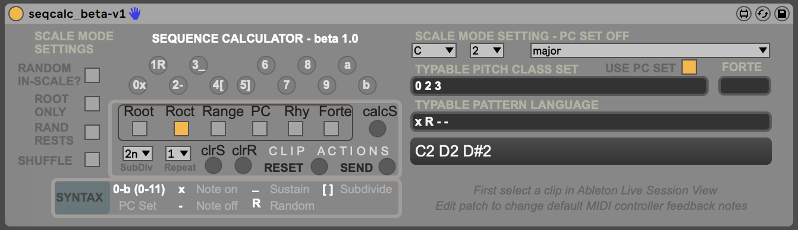
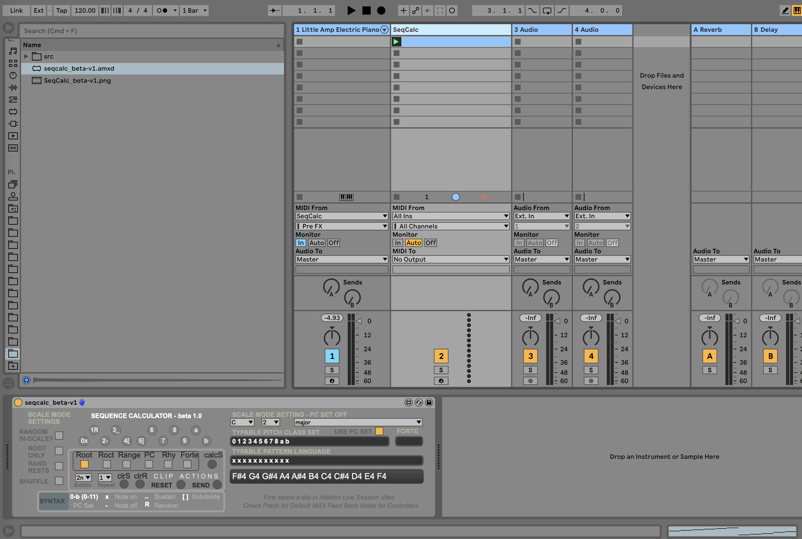

# SeqCalc



## Set-Theory Oriented Max4Live Sequencer / Calculator

This device would not be possible without [Scribbletune](https://scribbletune.com) and [Tonal](https://github.com/tonaljs). Please check the links to learn the latest about these fantastic projects. As time permits, SeqCalc will be updated to incorporate any future enhancements to these libraries as deemed suitable.

The idea behind SeqCalc is to use [pitch-class (PC) sets](https://en.wikipedia.org/wiki/Set_(music)) to help generate melodic sequences in the context of Ableton Live *-- tested using Live Suite v10 on MacOS Catalina*. 

If you are unfamiliar with how PC Set notation is used in the realm of music composition, please see the Background/Info links below. One may think of the set approach as a more purely mathematical abstraction where integers (and permutations thereof) are used to describe music rather than the more traditional harmonic language of major, minor, dominant, etc. "The Structure of Atonal Music", an imporant work by Allen Forte, helped fortify set theory oriented analysis in modern music. 

SeqCalc uses these concepts but also leverages Scribbletune note and pattern syntax with buttons than can be MIDI-mapped to any MIDI controller device (i.e., Launchpad). This is intended to help make it more usable in the live setting.

To load the SeqCalc Max device, copy the following files to a directory visible within Ableton Live "places" and then load to a dedicated track like you would with any M4L device. It's best to have a dedicated track as there are certain buttons with hardcoded MIDI notes for feedback on Launchpad devices.

```seqcalc_beta-v1.amxd```
```scribble1.js```
```params.js```
```settheory.js```

An example session might look something like the following once it's been loaded



Depending on the chosen mode, once a PC Set (or scale) and [pattern](https://scribbletune.com/documentation/core/clip#pattern) is entered for a selected Ableton clip, click the "CalcS" and "Send" buttons to generate a new clip based on the current settings. The chosen clip should change on-demand.

### TO-DO:
- Better documentation and descriptions of features and how to use them - for now, load the device and experiment. Feel free to contribute !
- Overview/demo videos - see [this clip on Instagram](https://www.instagram.com/p/CJ4rnksBiWx) to see an earlier version in action. More demos to come...
- Ability to load PC Sets based on Forte Numbers *(added to v2 on 1/22/2021)*
- Presets?

### Set Theory Background/Info
- https://en.wikipedia.org/wiki/Set_(music)
- https://en.wikipedia.org/wiki/List_of_pitch-class_sets


### Recompilation Notes
- https://scribbletune.com/documentation/max
- https://github.com/tonaljs/tonal
- Once all Node.js requirements and Scribbletune dependencies are met, simply run the following to create the needed "scribble1.js" file:
```npx webpack```
